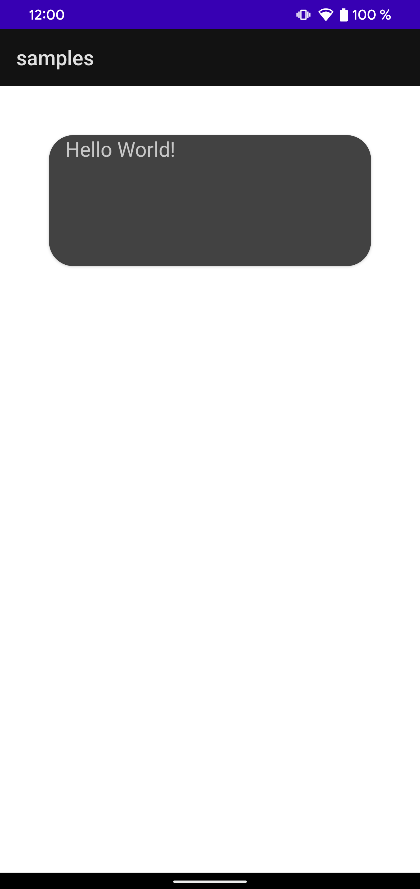
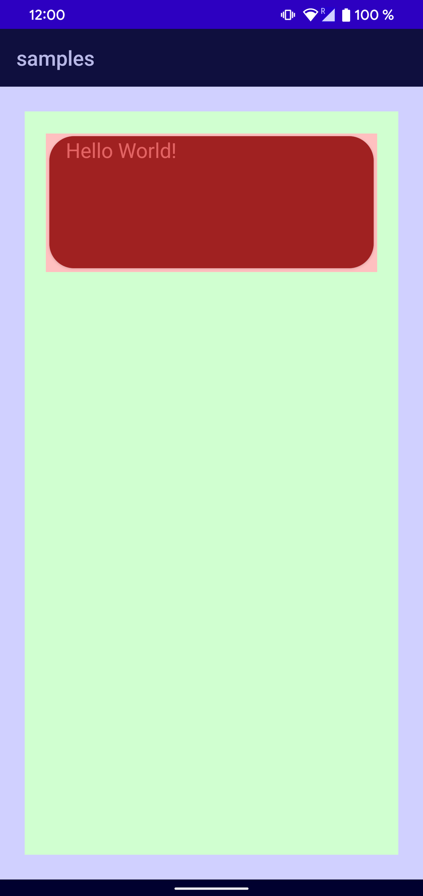

[](https://jitpack.io/#by.epicbot/toster)
[](https://opensource.org/licenses/Apache-2.0)
[](https://github.com/alexander-kulikovskii/toster/actions/workflows/build_dsl.yml)
[](https://codecov.io/github/alexander-kulikovskii/toster?branch=main)

# toster

Small test dsl based on adb commands that allows you to test the mobile application close to user actions


## How to install

Add next fields in your root `build.gradle` file:
```groovy
allprojects {
    repositories {
        ...
        maven { url 'https://jitpack.io' }
    }
}
```
Add the dependency:
```groovy
dependencies {
    implementation 'by.epicbot:toster:{version}'
}
```

## Usage

To use Toster DSL you need to create unit tests extended from the `TosterTest` class and configure `Config` and `Screens`.

You can run it using console command: 

```
./gradlew :project:test
```

If you want to run it from Android Studio, don't forgot to install [Kotest plugin](https://plugins.jetbrains.com/plugin/14080-kotest):


Here's a full list of available functionality of Toster:
 
```kotlin
class DemoTest : TosterTest(
   Config {
       applicationName("Samples")
       applicationPackageName("fi.epicbot.toster.samples")
       apkUrl("build/outputs/apk/debug/samples-debug.apk")
       permissions {
           grant("PERMISSION")
           grant("ANOTHER_PERMISSION")
       }
       devices {
           emulator("Pixel_3a_API_31_arm64-v8a")
           phone("123456789")
       }
       fontScaleForAll(FontScale.LARGE)
       emulatorPath("android-sdk/emulator")
       clearDataBeforeEachRun()
       runShellBeforeAllScreens("SHELL_COMMAND_BEFORE_ALL")
       runShellAfterAllScreens("SHELL_COMMAND_AFTER_ALL")
   }
   Screens{
       screen{
           name("First screen")
           url("fi.epicbot.toster.samples.SampleFontSizeActivity")
           shortUrl("SampleFontSizeActivity") // optional
           delayAfterOpenMillis(4500L)
           runShellBefore("SOME_COMMAND")
           runShellAfter("SOME_COMMAND")
           clearDataBeforeRun()
           activityParams {
               integer("int_value", 42)
               string("string_value", "42")
               long("long_value", 42L)
               boolean("boolean_value", true)
               float("float_value", 42.0f)
           }
           permissions {
               revoke("PERMISSION_1")
               grand("PERMISSION_2")
           }
           fontScale(FontScale.SMALL)
           resetGfxInfoBeforeStart()
           actions {
               delay(1000L)
               click(x, y)
               swipe(SwipeMove.BottomToTop, delayMillis = 500)
               takeMemoryAllocation()
               takeScreenshot("name")
               runShell("COMMAND")
               takeGfxInfo()
           }
       }
   }
)
```

## Config

### Application name
Set any name for your project. All output data will be in `build/toster/APPLICATION_NAME`
```kotlin
applicationName("Samples")
```

### Application package name
Package name that you can find in manifest file.

### Apk url

Path to your apk file.

### Permissions

Toster doesn't install apk with flag `-p` and set them all because for some screens you can revoke them or call clear data.

In the block `Config` you can only grant permissions:

```kotlin
permissions {
   grant("PERMISSION")
   grant("ANOTHER_PERMISSION")
   ...
}
```

Block `Screen` allows grant and revoke permissions:

```kotlin
permissions {
   grant("PERMISSION")
   ...
   revoke("ANOTHER_PERMISSION")
   ...
}
```

### Devices

Specify all devices, including their IDs, on which the tests will be performed.

To find ID for specific device you can use adb command `adb devices`.

```kotlin
devices {
   emulator("Pixel_3a_API_31_arm64-v8a")
   ...
   phone("123456789")
   ...
}
```

Note: You can use `UUID` if you have only one device.

### Font scale for all

To set up the font scale for the whole screen you can use fontScale(value) command.

Available font scales:
- SMALL (0.85)
- DEFAULT (1.0)
- LARGE (1.15)
- LARGEST (1.3)

### Emulator path
Path to emulator in your sdk folder.

### Clear data before each run

Clear application data before each run. All permissions will be removed.

### Run shell before all screens

Run shell script before all screens. For example, you can build a special flavor of your app.

### Run shell after all screens

Run shell script after all screens. For example, you can send some analytics to the backend or make work on CI.

### Overdraw

To set up overdraw mode for the all screens you can use ` checkOverdraw()` function.

Sample output for this mode:

| Normal                                                   | Overdraw                                                   |
|----------------------------------------------------------|------------------------------------------------------------|
|  |  |

## Screen

### Name

Unique name for the screen.

### Url

Full url for your activity including package name.

### Delay after open

It's very important to set delays between actions, because the whole test system doesn't know about callbacks. 

### Run shell before

Same as `shellBeforeAllScreens`. It runs some script before this screen. For example, you can prepare some data for this screen.

### Run shell after

Same as above. Runs after this screen.

### Clear data before

Clear application data only before this screen.

### Clear apps in tray

Clear all apps in tray before this screen

###

## Output reports

By default, after all tests you will get a json file with all actions that test done.
It is generated with a default reporter. You can disable it, changing it in block `Config` -> `report`:

```kotlin
Config {
   ...
   report {
       enable(true|false)
   }
   ...
}
```

Or you can even add your own reporter:
```kotlin
Config {
   ...
   report {
       addCustomReporter(MyAwesomeReporter)
   }
   ...
}
```

To implement your own reporter just extends from interface `Reporter`:

```kotlin
 
class MyAwesomeReporter : Reporter {
 
   override fun makeReport(reportOutput: ReportOutput, shellExecutor: ShellExecutor) {
       // Implementation
   }
}
 
```

You will get raw `ReportOutput` with all information about screens and actions, path to all screenshots, memory measurements (if applicable) and `shellExecutor` if it's necessary to run some commands (save report, send somewhere to backend, etc.).
